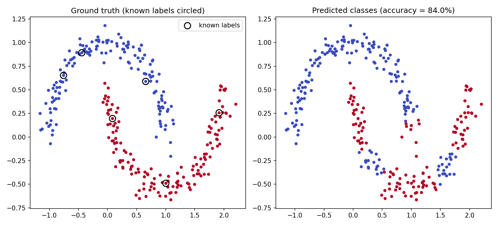

# Graph-Based Classification via Diffuse Interface Models


An implementation of semi-supervised classification on graphs using a Ginzburg-Landau diffuse-interface energy model, minimised via convex splitting in a low-dimensional graph Laplacian eigenbasis.

This is a from-scratch implementation of the method described in Bertozzi & Flenner, *"Diffuse Interface Models on Graphs for Classification of High Dimensional Data"* (SIAM Review, 2016), written alongside my Master's thesis on the same topic at the University of Koblenz. It's a clean demonstration of the algorithm on a public toy dataset, not the thesis's internal codebase.

## Result



Using only **6 labelled points out of 300** (3 per class, circled in the left panel), the model correctly classifies the rest of the dataset with **84% accuracy**, purely from the graph structure of the data.

## How it works

| Step | File | What happens |
|---|---|---|
| 1. Graph construction | `graph_utils.py` | Builds a symmetric k-nearest-neighbour graph with Gaussian similarity weights, computes the normalised graph Laplacian |
| 2. Spectral basis | `graph_utils.py` | Projects the classification problem onto the leading eigenvectors of the graph Laplacian, drastically reducing the dimensionality of the optimisation |
| 3. Diffuse interface energy | `diffuse_interface_classifier.py` | Relaxes the discrete graph-cut classification problem into a continuous Ginzburg-Landau energy functional, with a fidelity term anchoring the known-labelled points |
| 4. Convex splitting | `diffuse_interface_classifier.py` | Minimises the energy iteratively via a convex-splitting numerical scheme, unconditionally stable for this non-convex energy |
| 5. Classification | `run_two_moons_demo.py` | The sign of the final continuous field gives the predicted class for every point, including the unlabelled ones |

## Tools used

Python, NumPy, SciPy (k-NN distances, eigendecomposition), scikit-learn (dataset generation), Matplotlib (visualisation)

## How to run

```bash
pip install numpy scipy scikit-learn matplotlib
python run_two_moons_demo.py
```

## Background

This method is the core of my Master's thesis, *"Classification of High-Dimensional Data on Graphs using Diffuse Interface Models and Graph Laplacians"*, at the University of Koblenz, where I extend this approach to higher-dimensional real-world datasets and analyse parameter sensitivity and classification accuracy in depth.

## Reference

Bertozzi, A. L., & Flenner, A. (2016). Diffuse Interface Models on Graphs for Classification of High Dimensional Data. *SIAM Review*, 58(2), 293-328.
